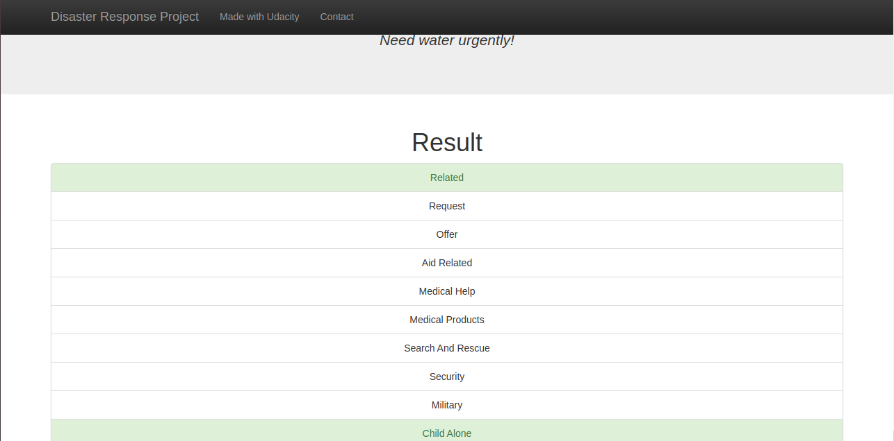

# disaster-response-pipeline

**Description**

In this project I  applied the data pipeline skills learned to analyze disaster data from Figure Eight to build a model for an API that classifies disaster messages.The initial dataset contains pre-labelled tweet and messages from real-life disaster. The aim of the project is to build a Natural Language Processing tool that categorize messages.I built a machine learning pipeline to categorize emergency messages based on the needs communicated by the sender.

**Dependencies**

1.Python 3.5+ 
2.Machine Learning Libraries: NumPy, SciPy, Pandas, Scikit-Learn
3.Natural Language Process Libraries: NLTK
4.SQLlite Database Libraqries: SQLalchemy
5.Web App and Data Visualization: Flask, Plotly
You can install each dependencies by using pip.

**Installation**

After installing the dependencies you need to clone this repository by using the below command
git clone https://github.com/Abhishek1236/diaster-response-pipeline.git

**Instructions to run the model**

1.Run the following commands in the project's root directory to set up your database and model.

2.To run ETL pipeline that cleans data and stores in database **python data/process_data.py data/disaster_messages.csv data/disaster_categories.csv data/DisasterResponse.db**
3.To run ML pipeline that trains classifier and saves **python models/train_classifier.py data/DisasterResponse.db models/classifier.pkl**
it will create a pickle file in the models directory which will be used in further process.Run the following command in the app's directory to run your web app. **python run.py**

Go to **http://0.0.0.0:3001/** to check whether your app is working fine or not.

**File Description**
A. **process_data.py**: A ETL Pipeline 
that
1. loads the messages and categories datasets
2. merges the two datasets
3. cleans the data
4. stores it in a SQLite database
B. **train_classifier.py**:
A Machine Learning Pipeline that
1. loads data from the SQLite database
2. splits the dataset into training and test sets
3. builds a text processing and machine learning pipeline
4. trains and tunes a model using GridSearchCV
5. outputs results on the test set
6. exports the final model as a pickle file

C. **run.py** :A Flask Web App that visualizes the results

**Acknowledgement**
1. **Udacity** for providing knowledge about the Etl pipelines and it application to solve real world data science problems.
2. **Figure Eight** for providing the data.

1. This is an example of a message we can type to test the performance of the model

2. After clicking **Classify Message**, we can see the categories which the message belongs to highlighted in green

3. The main page shows some graphs about training dataset, provided by Figure Eight

4. Sample run of process_data.py

5. Sample run of train_classifier.py

6. Sample run of train_classifier.py with precision, recall etc. for each category

